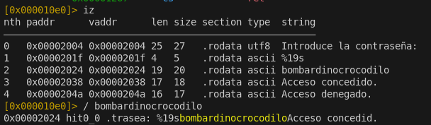
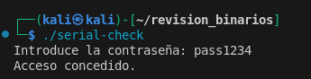
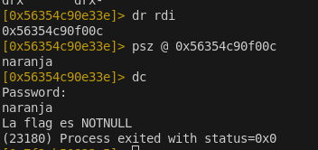

# Ejercicios de reversing

## Ejercicio 1

1. Compila el código fuente `hello.c` y ejecuta el programa. ¿Qué hace? ¿Qué salida produce?

Al compilar el código fuente con la biblioteca gcc podemos generar un arhcivo ejecutable, si ejecutamos ese archivo hará un:

```plaintext
Hola, mundo!
```
2. Analiza el ejecutable con `objdump` y `strings`. ¿Qué instrucciones se utilizan para imprimir la cadena? ¿Qué cadenas aparecen en el ejecutable?

Instrucciones para imprimir la cadena:

```plaintext
0000000000001020 <puts@plt-0x10>:
    1020:       ff 35 ca 2f 00 00       push   0x2fca(%rip)        # 3ff0 <_GLOBAL_OFFSET_TABLE_+0x8>
    1026:       ff 25 cc 2f 00 00       jmp    *0x2fcc(%rip)        # 3ff8 <_GLOBAL_OFFSET_TABLE_+0x10>
    102c:       0f 1f 40 00             nopl   0x0(%rax)
```

Cadenas que aparece en el ejecutable son:

```plaintext
Hola, mundo!
```
3. Analiza el ejecutable con radare2, obten las direcciones de las funciones usadas.

Direcciones usadas:

```plaintext
0x00001030    1      6 sym.imp.puts
0x00001040    1      6 sym.imp.__cxa_finalize
0x00001050    1     33 entry0
0x00001080    4     34 sym.deregister_tm_clones
0x000010b0    4     51 sym.register_tm_clones
0x000010f0    5     54 entry.fini0
0x00001130    1      9 entry.init0
0x00001154    1      9 sym._fini
0x00001139    1     26 main
0x00001000    3     23 sym._init
```

4. Analiza la funcion `main`, ¿que puedes obtener a partir de la misma?

```plaintext
[0x00001050]> pdf @ main
            ; ICOD XREF from entry0 @ 0x1064(r)
┌ 26: int main (int argc, char **argv, char **envp);
│           0x00001139      55             push rbp
│           0x0000113a      4889e5         mov rbp, rsp
│           0x0000113d      488d05c00e..   lea rax, str.Hola__mundo_   ; 0x2004 ; "Hola, mundo!"
│           0x00001144      4889c7         mov rdi, rax                ; const char *s
│           0x00001147      e8e4feffff     call sym.imp.puts           ; int puts(const char *s)
│           0x0000114c      b800000000     mov eax, 0
│           0x00001151      5d             pop rbp
└           0x00001152      c3             ret
```

push rbp y mov rbp, rsp:
Establecen el frame base de la función, parte del prólogo estándar.

lea rax, str.Hola__mundo_: Carga la dirección de la cadena "Hola, mundo!" en rax.

mov rdi, rax:
Pasa esa dirección como primer argumento a puts, siguiendo el ABI de x86_64 Linux.

call sym.imp.puts:
Llama a la función puts (ubicada en la tabla de símbolos importados).

mov eax, 0:
Devuelve 0 como valor de salida de main.

pop rbp y ret:
Restaura el valor anterior del frame base y retorna al caller.

## Ejercicio 2

Analiza el ejecutable `serial-check` y obtén acceso a la aplicación. 

```bash
aaa
afl
iz
/ bombardinocrocodilo
```



## Ejercicio 3

Modifica el ejecutable de `serial-check` para que acepte el serial `pass1234`.

```bash
r2 -w  ./serial-check
aaa
iz
wx 70617373313233340000000000000000000000 @ 0x00002024
q
```



## Ejercicio 4

Analiza los ejecutables `mindreader` y `mindreader2`. ¿Eres capaz de saber cual está compilada desde C, y cual desde python? ¿Por qué?

El archivo mindreader está compilado en C, mientras que mindreader2 está hecho en Python. Esto se puede deducir porque en el main de mindreader2 aparece una instrucción como lea rdi, str._PYI_APPLICATION_HOME_DIR ; 0x4090cc ; "_PYI_APPLICATION_HOME_DIR", que es un indicio claro de que el binario fue generado desde un script Python.

## Ejercicio 5

Ambos ejecutables tienen una flag, intenta hacer que el programa te de la flag. **NO** sirve encontrar la flag como un string, debes provocar que el ejecutable lo devuelva en tiempo de ejecución.

El ejecutable ***mindreader***, como he conseguido la flag:

```bash
r2 -d ./ejecutable
aaa
afl
pdf @ main
db "0x56354c90e33e" DE LA FUNCION QUE LLAMA PARA ELEGIR LA CLAVE
dc
dr rdi
psz @ "Valor que me del 'dr rdi'"
dc
```
Después de hacer el dc podemos introducir la clave que nos ha dado y ver la flag que es **NOTNULL**



